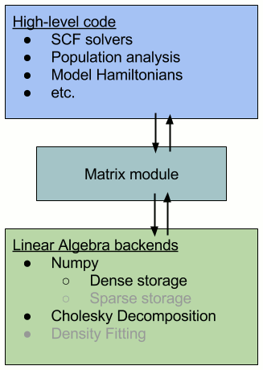

..
    : HORTON: Helpful Open-source Research TOol for N-fermion systems.
    : Copyright (C) 2011-2016 The HORTON Development Team
    :
    : This file is part of HORTON.
    :
    : HORTON is free software; you can redistribute it and/or
    : modify it under the terms of the GNU General Public License
    : as published by the Free Software Foundation; either version 3
    : of the License, or (at your option) any later version.
    :
    : HORTON is distributed in the hope that it will be useful,
    : but WITHOUT ANY WARRANTY; without even the implied warranty of
    : MERCHANTABILITY or FITNESS FOR A PARTICULAR PURPOSE.  See the
    : GNU General Public License for more details.
    :
    : You should have received a copy of the GNU General Public License
    : along with this program; if not, see <http://www.gnu.org/licenses/>
    :
    : --

How to use HORTON's ``matrix`` package?
#######################################

Introduction
============

In HORTON, we use our own ``matrix`` package (abstraction layer) to implement the
linear algebra code (low-level code) into the quantum chemistry code (high-level code). There
are two main reasons for such an architecture:

1. We can develop new linear algebra operations without breaking the higher-level
   code. For example, if we implemented Cholesky decomposition for the transformation
   of 2-electron integrals, we should be able to use this method in the geminals
   code without rewriting this code.
2. Numpy, the conventional linear algebra package in Python, may not manage
   memory effectively for large objects, such as the 2-electron
   integrals. For example, Numpy allocates temporary memory when evaluating ``a += b``, which
   is costly when  ``a`` or ``b`` is very large. By developing a ``matrix`` package
   (using the Numpy package), we gear towards memory management of quantum
   chemistry calculations. So, the ``matrix`` package is used instead of Numpy package directly.

Although such an abstraction layer seems pedantic and ostentatious, requiring
a tedious implementation of all new operations into the ``matrix`` package, the
small penalty in performance and the ease of implementing different concepts
into the low-level areas of HORTON make it well worth the effort.

The image below represents this architecture schematically (the gray bullet points are future
implementations).

Using the ``matrix`` package
============================

The package ``horton.matrix`` is organized as follows:

The package consists of `backend` modules, each with their own implementation of
the data storage and data manipulation. So far, there are two such modules: a dense
Numpy storage and Cholesky decomposition of the Numpy storage. Because these
modules treat data fundamentally differently, the corresponding methods for manipulating
the data, as listed in ``base.py``, should be implemented separately. These methods are used by
the high-level modules.

The code for each module is structured by the type of data that is
manipulated within a class. So far, classes for 1-index tensor, 2-index tensor,
3-index tensor, 4-index tensor, and wavefunction expansion have been
implemented.

To avoid reallocation of memory, we use a :class:`.LinalgFactory` instance to
create these objects (e.g. 2-index tensor). This instance will allocate memory
for these objects, and then, the operations performed on these objects will modify
their own attributes directly. Most of the operations are in-place, i.e.
modifying their own data based on input and not returning any output.

For example, to create and modify a dense 2-index tensor, we first create a
:py:class:`~horton.matrix.dense.DenseLinalgFactory` instance and call it ``lf``:

.. code-block:: python

    lf = DenseLinalgFactory()

Then, we use ``lf`` to allocate a 2-index tensor object:

.. code-block:: python

    A = lf.create_two_index()      # 2-index tensor

Now, we can modify the 2-index tensor object by some in-place operations:

.. code-block:: python

    A.iadd(B)         # A = A + B
    A.idot(B)         # A = A * B

    # A = B + C is not a possible in-place operation, but doable in two steps:
    A.iadd(B)         # A = A + B
    A.iadd(C)         # A = A + C

Note that more complex operations, such as ``A = B + C``, can be broken up into
a series of in-place operations, that deal with the explicitly allocated memory.

We can also allocate other implemented objects using ``lf``:

.. code-block:: python

    A4 = lf.create_four_index()    # 4-index tensor
    wfn = lf.create_expansion()    # wavefunction expansion

Furthermore, we can pass ``lf`` as an argument to other parts of the code, where
it is used to allocate an object, like,

.. code-block:: python

    er = obasis.compute_electron_repulsion(lf)

We can appreciate the simplicity of implementing different modules by playing
with the different `backend` modules available. For example, instead of the
``DenseLinalgFactory``, we could have used,

.. code-block:: python

    lf = CholeskyLinalgFactory()

Making this change will not change any of the preceding code, provided that the
same methods and attributes are implemented in this module as well.

Many functions and classes have been implemented into the ``matrix`` package. It
may help to read over some of the documented module files in
:py:mod:`horton.matrix.dense` and :py:mod:`horton.matrix.cholesky` to see if a
desired function has already been implemented.
